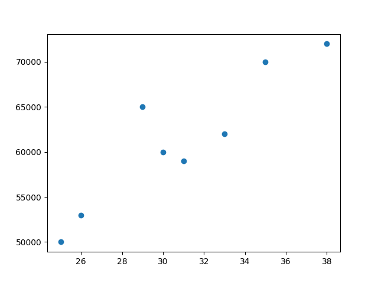
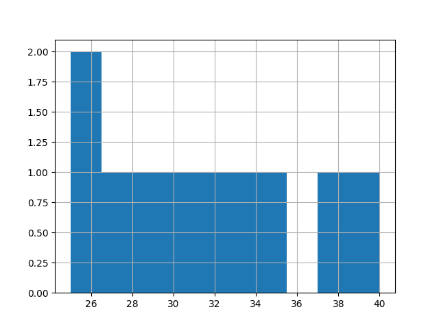

# FabricAir Data API

## Overview
FabricAir Data API is a service that allows users to upload CSV files, process data transformations, generate data summaries, and create visualizations. The API is built using FabricAir and utilizes Pandas and Matplotlib for data analysis and visualization.

## Features
- **Upload CSV Files**: Upload datasets for processing.
- **Data Summary**: Generate statistical summaries for numerical columns.
- **Data Transformation**: Normalize numerical columns and fill missing values.
- **Visualization**: Generate histogram and scatter plots for uploaded data.

## Project Structure
```
fabricair_data_api/
│── app/
│   ├── main.py                   
│   ├── routes/
│   │   ├── __init__.py            
│   │   ├── upload.py              
│   │   ├── summary.py             
│   │   ├── transform.py          
│   │   ├── visualize.py          
│   ├── services/
│   │   ├── __init__.py           
│   │   ├── file_storage.py        
│   │   ├── data_processor.py      
│── tests/
│   ├── test_upload.py             
│   ├── test_summary.py            
│   ├── test_transform.py          
│   ├── test_visualize.py          
│── static/                        
│── requirements.txt                
│── README.md                       

```
## Setup
### 1.Clone the Repository
git clone https://github.com/samysingh983/FabricAir.git
cd FabricAir

## Installation

### 1. Create and Activate a Virtual Environment
If using Conda:
```sh
conda create --name fabric_air python=3.10
conda activate fabric_air
```

### 2. Install Dependencies
```sh
pip install -r requirements.txt
```

## Running the API
Start the FabricAir server:
```sh
uvicorn main:app --reload
```
The API will be available at: [http://127.0.0.1:8000](http://127.0.0.1:8000)

## Accessing the API

Swagger UI (Interactive API Documentation)

Once the server is running, open the following URL in your browser:
```
http://127.0.0.1:8000/docs
```

## API Endpoints

### 1. Upload File
**Endpoint:** `POST /upload`
- **File:** "i have provide sample csv file"
- **Request:** Multipart file upload (`.csv` file)
- **Response:** JSON with `file_id`

### 2. Get Summary
**Endpoint:** `GET /summary/{file_id}`
- **Response:** JSON with statistical summary of numerical columns

### 3. Transform Data
**Endpoint:** `POST /transform/{file_id}`
- **Request Body:**
  ```json
  {
    "normalize": ["column1", "column2"],
    "fill_missing": {"column3": 0}
  }
  ```
- **Response:** JSON with new `file_id`

### 4. Generate Visualization
**Endpoint:** `GET /visualize/{file_id}`
- **Query Params:** `chart_type` (`histogram` or `scatter`), `columns`
- **Response:** JSON with `image_path`

## Running Tests
To run unit tests, use:
```sh
pytest tests/
```

## Dependencies
- FabricAir
- Pandas
- NumPy
- Matplotlib
- pytest
- Uvicorn

## Sample Image of Static file
Visualization for scatter and histogram:


